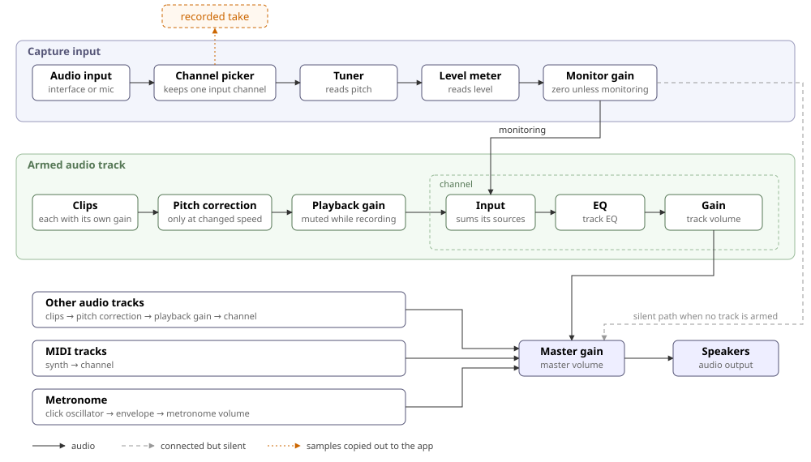

# Audio Signal Flow

- Monitoring goes through the armed track's channel, so the input follows that track's EQ and volume.
- With no track armed, the monitor stays connected to the master gain but silent, because Chromium stops rendering a chain without a path to the output, which would stop the tuner.
