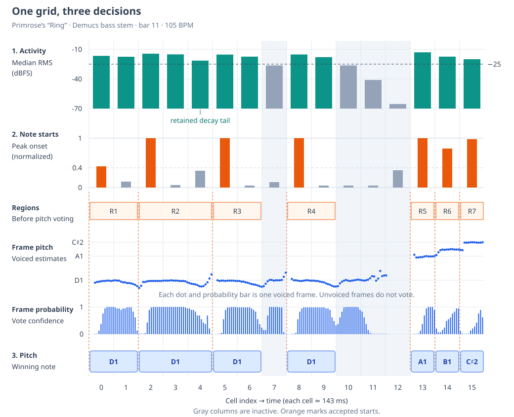

# Grid-Guided Bass Transcription

The project already knows the tempo, grid origin, and audio offset. If the recording contains one bass line, we can use that timing to restrict note boundaries to grid cells instead of searching for arbitrary start and end times. Transcription then becomes three ordered decisions: find sounding cells, split them at fresh attacks, and assign a pitch to each resulting region.

Each decision needs different evidence. A repeated note can have a new attack without changing pitch, while a clearly audible note can have an uncertain pitch estimate. Loudness establishes activity, spectral changes suggest articulation, and pYIN supplies pitch candidates.

## One Bar Through the Pipeline

The figure uses the recorded Primrose bar-11 example at 105 BPM. Each sixteenth-note cell lasts about 143 ms and contains roughly 12 analysis frames. All rows share the same time axis.

### Loudness Defines Active Runs

Within each cell, take the median frame RMS, a measure of signal amplitude. The example uses a threshold of −25 dBFS, where decibels are measured relative to full scale. This leaves three active runs, cells 0–6, 8–9, and 13–15. Taking a median reduces the influence of isolated loud or quiet frames.

Activity is deliberately permissive. Cell 4 contains a decay tail at −21.4 dBFS, so it stays active and extends the preceding note. Raising the threshold can remove tails, but can also lose short or quiet notes. Loudness alone cannot distinguish an intended sustain from an unwanted tail.

### Fresh Attacks Split the Runs

An active run always starts a region. Within the run, a cell starts another region when its maximum onset score reaches 0.4. Using a maximum preserves brief attacks, but also leaves the decision sensitive to spurious peaks. In the figure, accepted boundaries separate four D1 articulations before the final A1, B1, and C♯2 notes.

The onset score measures positive changes in log spectral power, grouped into frequency bands. Its scale is relative to the excerpt, with 1 representing values at or above the 95th percentile of positive flux. The [onset-detection article](onset-detection.md) develops why banding, logarithms, and positive differences help recognize a new attack.

### Pitch Labels Each Region

Each frame with a finite, decoded voiced pitch votes for its nearest MIDI note. Its weight is $0.1+0.9v$, where $v$ is pYIN's voiced probability, and the largest total wins. Pooling across a region lets several consistent estimates outweigh an isolated error. The [pYIN article](pyin.md) explains how the frame estimates and probabilities arise.

The positive weight floor keeps low-confidence estimates in the vote. It does not guarantee that every active region receives a pitch. If no frame supplies a finite voiced estimate, the region remains visible in the activity and onset diagnostics but is omitted from the final pitched output.

## What the Example Establishes

The illustrated settings retain the seven desired attacks in this bar. A stricter −20 dBFS activity threshold lost short notes in the original evaluation. Pitch probability was also a poor substitute for loudness, as a 0.5 probability gate accepted only 823 of 10,500 decoded voiced frames in the full-stem evaluation.

These results motivate separate evidence for activity, articulation, and pitch. They do not establish reliable transcription of arbitrary recordings. Energetic tails can extend notes, spectral fluctuations can add splits, and ambiguous periodicity can produce wrong or missing pitches. The monophonic source and known grid remain assumptions, and the output remains editable MIDI.

## Implementation Reference

The [Rust core](../../crates/bass-pitch/src/lib.rs) analyzes mono audio at 22.05 kHz using 2048-sample windows, about 93 ms, advanced by 256 samples, about 11.6 ms. It pools frames into complete grid cells using the relation `project time = source time + audio offset`. Boundaries are on the grid from the outset, rather than quantized afterward.

| Decision     | Evidence and computation                                                                                                      | Source function                                         |
| ------------ | ----------------------------------------------------------------------------------------------------------------------------- | ------------------------------------------------------- |
| Activity     | Median cell RMS against a threshold. Separate on/off thresholds support hysteresis, though both are −25 dBFS in this example. | `calculate_rms_frames`, `detect_activity`               |
| Segmentation | Maximum cell onset score splits active runs.                                                                                  | `calculate_onset_strength`, `make_activity_onset_notes` |
| Pitch        | Weighted vote over voiced frames in each region.                                                                              | `calculate_pyin_frames`, `assign_region_pitches`        |
| Output       | Convert project-time notes to MIDI ticks and expose intermediate decisions.                                                   | `midi_bytes`, `diagnostics_csv`                         |

pYIN runs in roughly 10-second chunks with 32 context frames on each side, which are discarded after decoding. This permits progress reporting but limits the sequence model's context. RMS and onset analysis use the whole excerpt, including the excerpt-wide onset normalization. The [guide](README.md#development-and-diagnostics) describes the CLI, intermediate MIDI, and CSV diagnostics used to inspect each decision.
