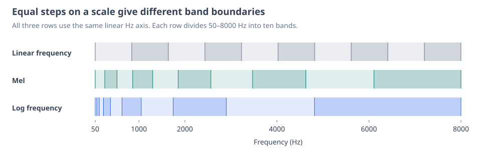
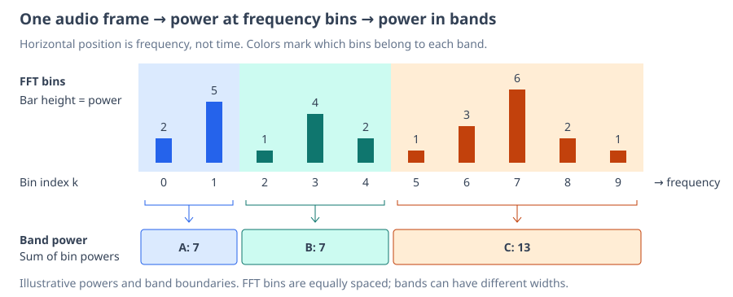
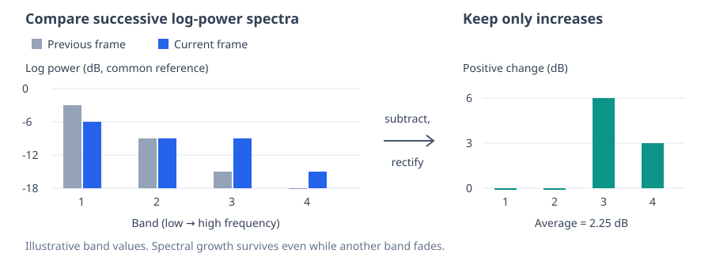

# Onset Detection from Spectral Changes

A bass line can strike the same pitch several times without falling silent. Pitch tracking sees little change, and a loudness gate may stay open throughout. A fresh attack, however, often renews power across the spectrum, including upper harmonics that had faded during the previous note.

Librosa’s `onset_strength`, used by our [Python reference](../../tools/bass-pitch/main.py), detects this renewal through **mel-banded log spectral flux**. The Rust implementation follows that construction with simplified frequency-band sums.

## Compare Band Power at a Useful Frequency Resolution

Take a short, windowed piece of audio, called a **frame**, and compute its Fourier transform. Each complex coefficient corresponds to a **bin** at an equally spaced frequency. Our 2048-sample frames at 22050 Hz give about 10.8 Hz between bins. Moving the window along the audio gives a short-time Fourier transform (STFT).

To compare broader frequency intervals, called **bands**, choose boundaries on the mel scale. It gives narrower intervals at low frequencies and wider ones at high frequencies:

Our implementation uses 128 equal steps in $m(f)=2595\log_{10}(1+f/700)$, from zero to Nyquist. The figure shows ten for clarity. Unlike a pure log scale, this curve becomes approximately linear at low frequencies.

Within each band, sum squared Fourier magnitudes. This is the frequency-domain version of summing squared samples, connected by Parseval’s identity. For FFT coefficients $X_t(k)$ in frame $t$ and the set of bins $\mathcal{B}_b$ in band $b$, define **band power** on a common FFT scale:

$$
P_t(b)=\sum_{k\in\mathcal{B}_b}|X_t(k)|^2.
$$

Summing before comparing frames lets redistribution within a band cancel. Two bins changing from $(10,2)$ to $(8,4)$ retain band power $12$, although counting positive bin changes separately would report an increase of $2$.

## Measure Relative Growth and Discard Decay

Express band power in decibels, $\ell_t(b)=10\log_{10}P_t(b)$. Its change between frames is the gain in dB:

$$
\ell_t(b)-\ell_{t-1}(b)=10\log_{10}\frac{P_t(b)}{P_{t-1}(b)}.
$$

For onset evidence, keep increases and discard decreases, so a fading band does not cancel a rising one. Average these positive dB changes:

$$
F_t=\frac{1}{B}\sum_{b=1}^{B}\max\bigl(0,\ell_t(b)-\ell_{t-1}(b)\bigr).
$$

This is **spectral flux**, a measure of how much the spectrum changes between frames. Here we count only increases, capturing the spectral renewal associated with an attack. Replacing negative changes with zero is called **rectification**.

The changes $(-3,0,6,3)$ become $(0,0,6,3)$, giving $F_t=2.25$ dB. Growth in some bands is enough, even while others fade.

## Use Spectral Flux to Split Notes

Our pipeline divides spectral flux $F_t$ by the 95th percentile of positive flux values in RMS-active grid cells and clips the result to $[0,1]$. Within an active region, a grid cell starts a new note when its maximum normalized flux reaches the [split threshold](algorithm.md#controls-in-toy-midi).

This normalization is a pipeline heuristic, not part of librosa’s `onset_strength`. Using active cells keeps inactive-cell residue out of the percentile reference.

## Implementation Details

The [Rust implementation](../../crates/bass-pitch/src/lib.rs) advances its 93 ms windows every 11.6 ms and delays the score by half a window to compensate for centered-window lookahead. It floors log power at 80 dB below the excerpt's peak, adds an absolute numerical floor, and suppresses flux far below its peak as rounding noise. These peak-relative operations also introduce excerpt dependence.

Band scores sum a one-sided FFT without the normalization and negative-frequency weighting needed for exact energy accounting. The Rust band boundaries use the HTK mel scale, while [librosa defaults](https://librosa.org/doc/main/api/generated/librosa.mel_frequencies.html) to the Slaney variant and uses overlapping triangular filters. The methods therefore share the construction rather than exact band weights.
