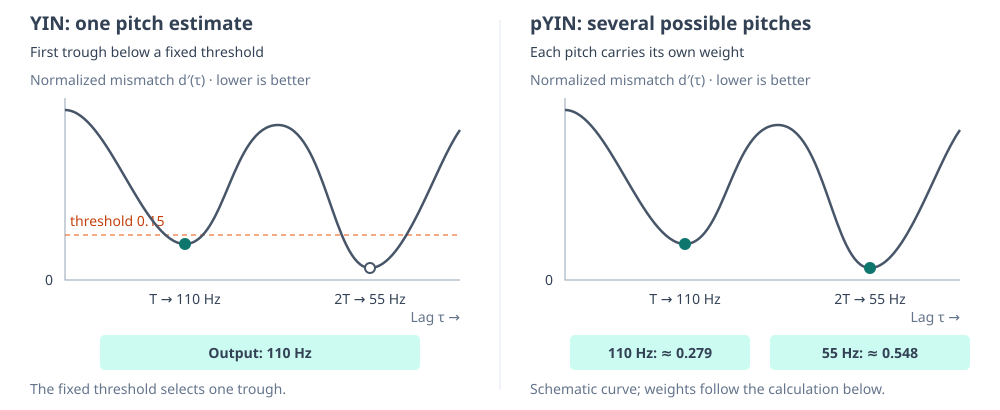
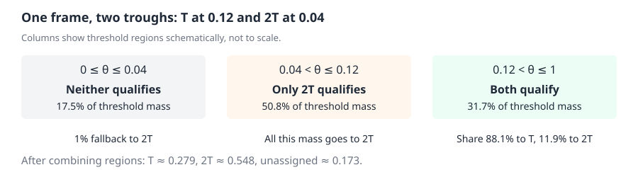
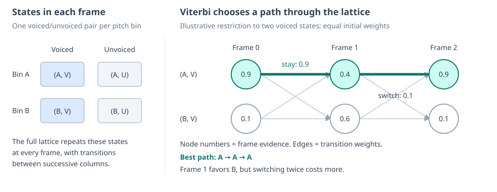
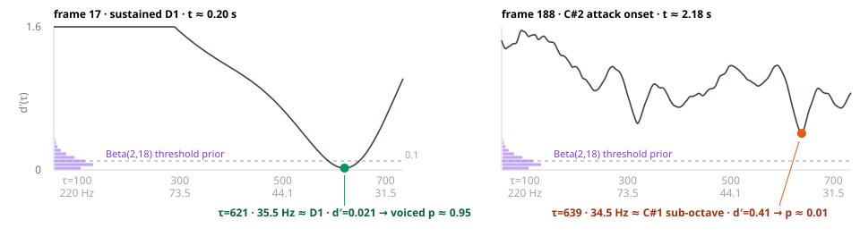
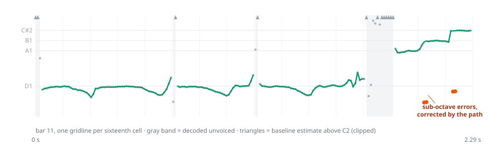

# pYIN: From Ambiguous Periods to a Pitch Sequence

One short audio frame can suggest several possible pitches. Choosing one immediately can make the estimate jump between them as the waveform changes. pYIN keeps those possibilities until neighboring frames can help choose a consistent pitch sequence.

[YIN](../concepts/yin-pitch-detection.md) supplies the starting point. Its normalized difference curve measures how well a waveform matches a copy shifted by lag $\tau$. A trough suggests a period of $\tau$ samples, or frequency $f=F_s/\tau$ at sample rate $F_s$. Longer lags therefore mean lower pitches.

## Possible Pitches Within a Frame

YIN selects the first trough below a fixed threshold. pYIN keeps several possible pitches and gives each a weight expressing the frame’s support for it. The sequence decoder chooses among them later.



This example uses troughs at $T$ and $2T$, corresponding to 110 Hz and 55 Hz, with mismatch depths 0.12 and 0.04. Their octave relationship is a common ambiguity, not a restriction on the possible pitches. Other trough locations give other frequencies. We call each possible pitch a **candidate**.

### Assign Weights to the Possible Pitches

Imagine sliding a horizontal threshold across the difference curve. At each height, distribute some weight among the troughs it accepts. The probability density $p(\theta)$ of the threshold determines how much weight each threshold contributes. The implementation makes the specific modeling choice of a Beta(2, 18) distribution, concentrated near low mismatch thresholds with mean 0.1.



The code divides $[0,1]$ into 100 equal threshold intervals. Each interval contributes its area under the curve, not just the curve’s height:

$$
w_k=\int_{\theta_{k-1}}^{\theta_k}p(\theta) d\theta,
\qquad \sum_k w_k=1.
$$

The upper boundary $\theta_k$ is the threshold tested for that strip. Taller strips carry more weight.

For this example, roughly 17.5% of the threshold mass accepts neither trough, 50.8% accepts only $2T$, and 31.7% accepts both. We now need to distribute each threshold’s mass among the troughs it accepts. When several qualify, pYIN retains a preference for shorter periods. Rank the qualifying troughs by lag, starting at zero, and give candidate $i$ the share

$$
q_{i,k}=\frac{e^{-\lambda r_{i,k}}}{\sum_{j\text{ qualifying}}e^{-\lambda r_{j,k}}},
\qquad \lambda=2.
$$

Thus two qualifying troughs share the threshold's mass in proportions about 0.881 and 0.119. This is a soft version of YIN's first-trough preference. The rank is among qualifying troughs, so it can change with the threshold.

Nonqualifying candidates receive zero. If none qualifies, our implementation gives just 1% of that bin's mass to the deepest trough and leaves the rest unassigned. With those rules included in $q_{i,k}$, add the contributions from all thresholds to obtain each candidate’s weight

$$
p_i=\sum_k w_kq_{i,k}.
$$

In the example, $p_T\approx0.279$ and $p_{2T}\approx0.548$, leaving about 0.173 unassigned. The longer period has stronger frame evidence, but the shorter one remains available. These weighting rules follow the software implementation, which differs from the original paper’s formulation.

Refine each candidate period using the same [parabolic interpolation as YIN](../concepts/yin-pitch-detection.md#refine-the-period-between-samples), convert it to frequency, and map it to a pitch bin on the decoder’s logarithmic grid, which has ten bins per semitone. Place the candidate’s weight $p_i$ in that bin.

For frame $t$, call this array of pitch-bin weights $P_t(n)$. These are the candidate weights indexed by pitch rather than period.

## Pitch Continuity Across Frames

The calculation above gives pitch-bin weights $P_t(n)$ for each frame. Use these as evidence in a **hidden Markov model** of pitch and voicing. Transition weights favor continuity, allowing neighboring frames to resolve ambiguity. **Viterbi decoding** chooses the highest-scoring path through this lattice.



### Keep Pitch and Voicing Separate

The pitch-bin weights $P_t(n)$ are the frame evidence derived above. Their total

$$
v_t=\sum_n P_t(n)
$$

is the frame's **voiced probability**. Here voiced means modeled as a periodic pitched sound. It does not mean that a bass note exists, and an attack can be audible while offering weak periodicity evidence.

Give each pitch bin both a voiced and an unvoiced state. For $N$ pitch bins, their observation weights are

$$
O_t(n,\mathrm V)=P_t(n),
\qquad O_t(n,\mathrm U)=\frac{1-v_t}{N}.
$$

The unassigned mass becomes unvoiced evidence. Giving it uniformly to the unvoiced pitch states lets the model carry a latent pitch through uncertain frames without claiming those frames contain a reliable pitch observation. Neighboring frames decide which latent pitch best connects the sequence.

### Prefer Plausible Transitions

Write a state as $s=(n,u)$, where $n$ is pitch and $u$ is voicing. A transition combines a preference for nearby pitches with a preference for retaining the same voicing:

$$
A((n,u),(m,v))=T(n,m)
\begin{cases}
1-\rho,&u=v,\\
\rho,&u\ne v.
\end{cases}
$$

Our pitch transition $T$ is a normalized triangular distribution centered on the previous pitch. With the bass settings, its support spans $\pm2.5$ semitones per 11.6 ms hop. The voicing-switch probability is $\rho=0.01$. These are continuity assumptions, so they can suppress implausible jumps but can also resist a real abrupt change.

### Decode the Path with Viterbi

For a path through $L$ frames, combine the initial distribution $\pi$, transition weights, and observation weights:

$$
\mathrm{score}(s_0,\ldots,s_{L-1})
=\pi(s_0)O_0(s_0)\prod_{t=1}^{L-1}A(s_{t-1},s_t)O_t(s_t).
$$

In the figure's two-voiced-state example, staying has probability 0.9 and switching has probability 0.1. Omitting the common initial factor,

```math
\begin{aligned}
\mathrm{score}(A,A,A)&=0.9\cdot0.4\cdot0.9\cdot0.9^2=0.26244,\\
\mathrm{score}(A,B,A)&=0.9\cdot0.6\cdot0.9\cdot0.1^2=0.00486.
\end{aligned}
```

The middle frame favors B, but not enough to justify two changes. Sustained evidence for B would accumulate across frames and could outweigh the transition cost. The decoder balances evidence rather than simply smoothing a sequence of already-selected pitches.

Viterbi is standard dynamic programming over successive frames. For each state, retain the best score of any path ending there and its winning predecessor:

$$
V_0(s)=\pi(s)O_0(s),
\qquad
V_t(s)=O_t(s)\max_r\bigl[V_{t-1}(r)A(r,s)\bigr].
$$

Choose the best final state, then backtrack through the stored predecessors to recover the path. The implementation uses log scores to avoid underflow. Its initial distribution is uniform over unvoiced states.

## Example: Primrose’s “Ring” Bass Stem

These normalized difference curves come from two frames in bar 11 of the Demucs-separated bass stem from Primrose’s “Ring”, the synth-like bass example used in the [pipeline overview](algorithm.md#one-bar-through-the-pipeline):



The sustained D1 frame has a trough near 0.021 and receives about 0.95 voiced probability. The C-sharp attack has a shallow sub-octave match near 0.41 and receives about 0.01. A fixed threshold would make a hard acceptance decision here. pYIN instead preserves weak pitch evidence while leaving most weight for the unvoiced states.



The gray dots use the deepest trough independently in each frame. This baseline differs from YIN's first-qualifying-trough rule. The green decoded path avoids several isolated sub-octave choices around note transitions. Continuity helps here, but cannot resolve an entire passage with consistently misleading evidence.

The frame weight $v_t$ and the decoded voiced flag are separate outputs. Our [bass transcription pipeline](algorithm.md#pitch-labels-each-region) uses them to vote for a region's pitch. Activity and onset evidence establish regions before pitch voting. Low probability alone does not reject a voiced pitch estimate, but a region with no finite voiced estimates is omitted from the final pitched output.

## Implementation Scale

We use a vendored copy of [`pyin-rs`](https://github.com/Sytronik/pyin-rs), a Rust port of librosa’s pYIN implementation. The current bass settings are:

| Setting          | Scale                                                                                                          |
| ---------------- | -------------------------------------------------------------------------------------------------------------- |
| Audio and frames | 22,050 Hz, 2048-sample frames, 256-sample hop, about 93 ms of audio per estimate and 11.6 ms between estimates |
| Pitch range      | 30–400 Hz, 449 pitch bins, 898 pitch/voicing states                                                            |
| Thresholds       | Beta(2, 18), 100 bins, shorter-period preference $\lambda=2$                                                   |
| Continuity       | 51-bin triangular window, spanning $\pm2.5$ semitones, voicing-switch probability 0.01                         |

[`PYINExecutor`](../../crates/pyin/src/pyin.rs) builds the candidates, observations, and transitions, while [`viterbi.rs`](../../crates/pyin/src/viterbi.rs) selects the path. The transition's zero entries become very strong penalties because the numerical decoder adds a small positive value before taking logarithms.
