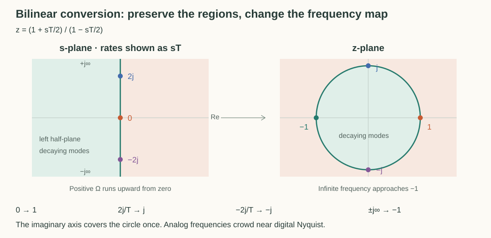

# From an Analog Response to Digital Coefficients

The [peaking-EQ design](peaking-eq.md) gives us an analog response with the desired gain and width. We now need a recurrence that computes output samples. The challenge is to preserve the useful response shape and decaying dynamics while replacing continuous-time operations with sample delays.

## Convert Continuous Dynamics into Sample Updates

[Sampling a continuous mode](transfer-functions.md#the-s-plane-and-z-plane) gives $z=e^{sT}$, where $T=1/F_s$ is the sample interval. Substituting its inverse $s=\log(z)/T$ into a rational analog response does not generally produce the finite rational function of delays needed for a biquad.

### Derive the Bilinear Mapping

Instead, we can approximate the continuous system's integration rule. Let $I'=x$. Over one sample interval, approximate the integral by the interval length times the average of the two endpoint values:

$$
I[n]-I[n-1]=\frac{T}{2}\bigl(x[n]+x[n-1]\bigr).
$$

This is the trapezoidal integration rule. For exponential sequences, a one-sample delay multiplies by $z^{-1}$, so this discrete integrator has multiplier

$$
\frac{I}{x}=\frac{T}{2}\frac{1+z^{-1}}{1-z^{-1}}.
$$

The continuous integrator has multiplier $1/s$. Equating the two gives the **bilinear substitution** and its inverse:

$$
s\leftarrow\frac{2}{T}\frac{1-z^{-1}}{1+z^{-1}},
\qquad
z=\frac{1+sT/2}{1-sT/2}.
$$

Unlike the exact exponential mapping, this is a rational approximation derived from a chosen integration rule. Substitution into a quadratic analog response produces a quadratic digital response after clearing denominators.

### Preserve Decay While Warping Frequency

Let $s=\sigma+j\Omega$. The bilinear map has

$$
|z|^2=
\frac{(1+\sigma T/2)^2+(\Omega T/2)^2}
{(1-\sigma T/2)^2+(\Omega T/2)^2}.
$$

When $\sigma\lt 0$, the numerator is smaller than the denominator, so $|z|\lt 1$. When $\sigma=0$, their ratio is one. Thus decaying analog poles remain inside the unit circle, and the imaginary axis maps to the circle itself.



For a sustained tone, put $z=e^{j\omega}$ into the substitution. The identity $(1-e^{-j\omega})/(1+e^{-j\omega})=j\tan(\omega/2)$ gives

$$
s=j\Omega,
\qquad
\Omega=\frac{2}{T}\tan\frac{\omega}{2},
\qquad
\omega=2\arctan\frac{\Omega T}{2}.
$$

Each digital frequency therefore reads the analog response at a corresponding analog frequency. Positive analog frequencies from zero to infinity map monotonically onto digital angles from zero to $\pi$. The response values retain their order, but their frequency spacing changes. This is **frequency warping**.

|                    | Exact mode sampling                | Bilinear system mapping                                          |
| ------------------ | ---------------------------------- | ---------------------------------------------------------------- |
| Mapping            | $z=e^{sT}$                         | $z=(1+sT/2)/(1-sT/2)$                                            |
| Frequency relation | $\omega=\Omega T\pmod{2\pi}$       | $\omega=2\arctan(\Omega T/2)$                                    |
| Imaginary axis     | Wraps repeatedly around the circle | Covers the circle once, approaching $z=-1$ at infinite frequency |
| Left half-plane    | Maps inside the circle             | Maps inside the circle                                           |

The bilinear map preserves decay and the sequence of frequency-response values, but does not reproduce the exact samples of each continuous mode.

## Apply the Mapping to the Peaking EQ

### Place the Center with Prewarping

The user chooses a center frequency $f_0$ in hertz. Its digital angle is $\omega_0=2\pi f_0/F_s$. To make the warped analog response peak there, choose the analog center to be

$$
\Omega_0=\frac{2}{T}\tan\frac{\omega_0}{2}.
$$

This choice is called **prewarping**. At low frequencies, $\tan(\omega_0/2)\approx\omega_0/2$, so the correction is small, but near Nyquist it becomes substantial.

The peaking prototype uses normalized rate $u=s/\Omega_0$. Substituting the mapping and prewarped center cancels $2/T$:

$$
u\leftarrow K\frac{1-z^{-1}}{1+z^{-1}},
\qquad K=\cot\frac{\omega_0}{2}.
$$

At $z=e^{j\omega_0}$, this gives $u=j$, exactly the prototype's center. Its gain is therefore preserved. The same mapping also preserves the inverse relationship of matching boosts and cuts. Width still undergoes frequency warping, so the analog meaning of $Q$ as reciprocal normalized halfway bandwidth is not an exact digital bandwidth rule.

### Recover the Delay Coefficients

The designed prototype is

$$
P(u)=\frac{u^2+(A/Q)u+1}{u^2+u/(AQ)+1},
\qquad A=\sqrt M.
$$

Only the coefficient of $u$ differs between its two quadratics. Write $d=z^{-1}$ for one delay and expand $u^2+cu+1$ once. After substituting $u=K(1-d)/(1+d)$ and clearing $(1+d)^2$, the polynomial is

```math
\begin{aligned}
P_c(d)&=K^2(1-d)^2+cK(1-d)(1+d)+(1+d)^2\\
&=(K^2+cK+1)+2(1-K^2)d+(K^2-cK+1)d^2.
\end{aligned}
```

Dividing numerator and denominator by the same constant $K^2+1$ leaves their ratio unchanged. The half-angle identities

$$
\frac{K}{K^2+1}=\frac{\sin\omega_0}{2},
\qquad
\frac{1-K^2}{1+K^2}=-\cos\omega_0
$$

turn the result into

$$
\frac{P_c(d)}{K^2+1}
=\left(1+\frac{c\sin\omega_0}{2}\right)
-2\cos\omega_0\cdot d
+\left(1-\frac{c\sin\omega_0}{2}\right)d^2.
$$

Use $c=A/Q$ for the numerator and $c=1/(AQ)$ for the denominator. With $\alpha=\sin\omega_0/(2Q)$, the unnormalized coefficients are

```math
\begin{aligned}
b_0&=1+\alpha A, & a_0&=1+\alpha/A,\\
b_1&=-2\cos\omega_0, & a_1&=-2\cos\omega_0,\\
b_2&=1-\alpha A, & a_2&=1-\alpha/A.
\end{aligned}
```

These are the weights of the constant, one-delay, and two-delay terms. The digital transfer function is their ratio:

$$
H_d(z)=\frac{b_0+b_1z^{-1}+b_2z^{-2}}
{a_0+a_1z^{-1}+a_2z^{-2}}.
$$

### Return to the Sample Loop

To compute $y[n]$ explicitly, divide every coefficient by $a_0$. Write $\beta_i=b_i/a_0$ and $\gamma_i=a_i/a_0$. The recurrence is

```math
\begin{aligned}
y[n]={}&\beta_0x[n]+\beta_1x[n-1]+\beta_2x[n-2]\\
&-\gamma_1y[n-1]-\gamma_2y[n-2].
\end{aligned}
```

For a 1 kHz center, +6 dB gain, and $Q=1$ at 48 kHz, use $M=10^{6/20}$ and $A=\sqrt M$. The resulting weights, rounded to six decimal places, are

$$
(\beta_0,\beta_1,\beta_2)=(1.043953,-1.895321,0.867722),
\qquad
(\gamma_1,\gamma_2)=(-1.895321,0.911675).
$$

These are the five values computed by [`calculateBiquadEqCoefficients`](../../../src/lib/dsp/biquad-eq.ts). The implementation stores the normalized values under the names `b0`, `b1`, `b2`, `a1`, and `a2`. The formula convention follows the [Audio EQ Cookbook](https://www.w3.org/TR/audio-eq-cookbook/).
