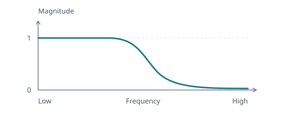
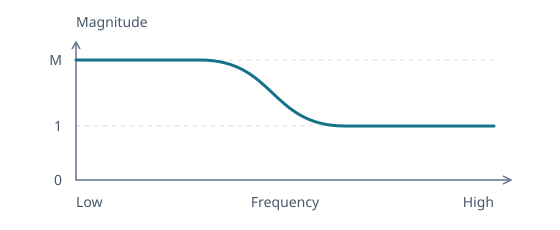

# Discovering Analog Biquad Filter Prototypes

The recorder EQ implements several second-order filters with one sample loop. Their coefficients are commonly presented as a table, but a table hides the interesting question: if we started only with the response we wanted, how would we invent each filter?

The [transfer-function article](transfer-functions.md#the-continuous-counterpart-of-the-sample-recurrence) gives us a second-order family to work with. As in the [peaking-EQ design](peaking-eq.md), we will constrain its coefficients through the desired response:

$$
H_a(s)=\frac{c_2s^2+c_1s+c_0}{s^2+d_1s+d_0}.
$$

Here $s$ is the continuous complex rate, and a tone is evaluated at $s=j\Omega$. We will construct a low-pass filter and a low shelf. They share this starting point, but their goals leave different freedom in the coefficients.

## Constructing a Low-Pass Response

A low-pass filter should leave slow variation unchanged while suppressing rapid oscillation. We want unity at zero frequency and a response that tends to zero as frequency increases. How much of the second-order family do those requirements determine?



_Schematic response. The transition shape depends on $Q$._

### Preserve Low Frequencies and Suppress High Frequencies

At zero frequency, only the constant terms remain. At high frequency, the leading powers dominate:

$$
H_a(0)=\frac{c_0}{d_0}=1,
\qquad
\lim_{|s|\to\infty}H_a(s)=c_2=0.
$$

Thus $c_0=d_0$ and $c_2=0$, leaving

$$
H_a(s)=\frac{c_1s+d_0}{s^2+d_1s+d_0}.
$$

The endpoints alone do not fix the rate of attenuation. If $c_1\ne0$, then $H_a(s)\sim c_1/s$ at high frequency. To get magnitude falling as $1/|s|^2$, we additionally require $c_1=0$:

$$
H_a(s)=\frac{d_0}{s^2+d_1s+d_0}.
$$

This second-order rolloff is a design choice beyond merely reaching zero.

### Separate Frequency Scale from Damping

Take $d_0,d_1\gt0$ so the natural motion decays. Without the damping term, the denominator $s^2+d_0$ has roots $\pm j\sqrt{d_0}$. This identifies the undamped natural frequency $\Omega_0=\sqrt{d_0}$.

Measure the complex rate relative to that frequency, $u=s/\Omega_0$. Dividing both polynomials by $\Omega_0^2$ gives

$$
H_a(\Omega_0u)=\frac{1}{u^2+(d_1/\Omega_0)u+1}.
$$

At the natural frequency, $u=j$, the quadratic and constant terms cancel:

$$
H_a(j\Omega_0)=-j\frac{\Omega_0}{d_1}.
$$

The remaining ratio measures the response at that frequency. Naming it $Q=\Omega_0/d_1$ gives

$$
H_a(\Omega_0u)=\frac{1}{u^2+u/Q+1}.
$$

This **quality factor** expresses damping relative to the frequency scale. We can now investigate which $Q$ gives the transition we want.

### Choose a Flat Passband

The squared magnitude shows how $Q$ shapes the passband. Write $\nu=\Omega/\Omega_0$ for the relative frequency. Substituting $u=j\nu$ gives

```math
\begin{aligned}
|H_a(j\Omega_0\nu)|^2
&=\frac{1}{(1-\nu^2)^2+\nu^2/Q^2}\\
&=\frac{1}{1+(Q^{-2}-2)\nu^2+\nu^4}.
\end{aligned}
```

Near zero frequency, the $\nu^2$ term determines how the response leaves unity. When $Q^{-2}\gt2$, the denominator increases, so the magnitude falls. When $Q^{-2}\lt2$, the denominator initially decreases, so the magnitude rises above unity before falling, creating a bump in the passband.

To keep the passband as flat as possible near zero frequency, cancel the $\nu^2$ term:

$$
Q^{-2}-2=0,
\qquad
Q=\frac{1}{\sqrt{2}}.
$$

The squared magnitude then becomes

$$
|H_a(j\Omega_0\nu)|^2=\frac{1}{1+\nu^4}.
$$

At $\nu=1$, the magnitude is $1/\sqrt2$, approximately $-3$ dB. Thus **$Q\approx0.71$ gives the flat-passband setting**, with the selected frequency at the $-3$ dB point. Above this $Q$, a peak develops before the rolloff.

Unlike the peaking EQ, this filter has no independent center-gain control. Its magnitude at $\Omega_0$ is $Q$, so $Q=1$ means 0 dB at that frequency even though the surrounding response has a peak. The same knob controls damping and the level at the selected frequency.

## Constructing a Low-Shelf Response

The low-pass construction makes the high-frequency response vanish. A low shelf asks for a different destination: preserve high frequencies while changing the level of low frequencies.



_Schematic response showing a boost, with $M\gt1$._

### Connect Two Nonzero Levels

For a low shelf, require $H_a(0)=M$ and $H_a(\infty)=1$, where $M\gt0$ is the low-frequency amplitude ratio. Values above one boost, and values below one cut.

In the general quadratic response, the endpoint conditions give $c_0=Md_0$ and $c_2=1$:

$$
H_a(s)=\frac{s^2+c_1s+Md_0}{s^2+d_1s+d_0}.
$$

The levels leave $c_1$, $d_1$, and $d_0$ free to determine the transition. We still need a meaning for the selected frequency and a way to prevent overshoot.

### Choose a Frequency Scale Between the Two Quadratics

For $d_0\gt0$, substituting $s=j\Omega$ gives

$$
H_a(j\Omega)=\frac{Md_0-\Omega^2+jc_1\Omega}{d_0-\Omega^2+jd_1\Omega}.
$$

The real parts of the numerator and denominator vanish at $\sqrt{Md_0}$ and $\sqrt{d_0}$, respectively. These give us two frequency scales. Choose $\Omega_0$ halfway between them on a logarithmic frequency axis, which means taking their geometric mean:

$$
\Omega_0=\sqrt{\sqrt{Md_0}\sqrt{d_0}},
\qquad
\Omega_0^2=\sqrt{M}\cdot d_0.
$$

Write $A=\sqrt M$, so $d_0=\Omega_0^2/A$, and normalize with $u=s/\Omega_0$. Dividing by $\Omega_0^2$ and rescaling the denominator gives

$$
H_a(\Omega_0u)
=A\frac{u^2+c_nu+A}{Au^2+c_du+1},
\qquad
c_n=\frac{c_1}{\Omega_0},
\qquad
c_d=\frac{Ad_1}{\Omega_0}.
$$

Choose positive $c_n,c_d$ so both quadratics have decaying modes. The frequency scale is now centered between the two quadratics, but that alone does not make its response halfway between the two levels.

### Place the Center Halfway Between the Levels

We also want the selected frequency to lie halfway between the plateau levels in decibels. Its amplitude must therefore be $\sqrt M=A$. At $u=j$,

$$
H_a(j\Omega_0)=A\frac{(A-1)+jc_n}{(1-A)+jc_d}.
$$

The real parts have equal squared magnitude, so $|H_a(j\Omega_0)|=A$ requires $c_n^2=c_d^2$. With positive coefficients, this means $c_n=c_d=c$, leaving

$$
H_a(\Omega_0u)=A\frac{u^2+cu+A}{Au^2+cu+1}.
$$

The two levels and their midpoint now have the intended values. The remaining coefficient $c$ determines how the curve travels between them.

### Avoid Overshoot Between the Plateaus

A monotonic shelf should move from the low-frequency level $M$ to the high-frequency level 1 without overshooting either plateau. For a boost, the magnitude should decrease throughout the transition. For a cut, it should increase. When $M=1$, numerator and denominator coincide and the response is flat.

Write $x=(\Omega/\Omega_0)^2$ and remove the constant gain factor from the squared magnitude:

$$
R(x)=\frac{|H_a(j\Omega_0\sqrt{x})|^2}{A^2}
=\frac{(A-x)^2+c^2x}{(1-Ax)^2+c^2x},
\qquad x\ge0.
$$

As frequency rises, $x$ increases, so the sign of $R'$ tells us whether the shelf rises or falls.

Differentiating gives

$$
R'(x)=
\frac{(1-A^2)\left[(c^2-2A)(x^2+1)+2(1+A^2)x\right]}
{\left[(1-Ax)^2+c^2x\right]^2}.
$$

The denominator is positive. For a boost, $A\gt1$, so the factor $1-A^2$ is negative. For a cut, $A\lt1$, so it is positive. These are precisely the signs we want for a falling or rising shelf, provided the bracketed expression stays nonnegative.

The sign of $c^2-2A$ decides the shape. If it is negative, the bracket is negative at $x=0$, so the curve initially moves away from its destination. A boost rises above its low-frequency plateau, while a cut dips below it.

If instead

$$
c^2\ge2A,
$$

every term in the bracket is nonnegative for $x\ge0$. The magnitude then moves monotonically from $M$ to 1 and stays between those levels throughout. This is the shelf shape we wanted.

### Choose the Steepest Monotonic Transition

Within this monotonic family, $c$ still controls how gradual the transition is. At the midpoint, $x=1$,

$$
|R'(1)|=\frac{2|1-A^2|}{(A-1)^2+c^2}.
$$

Increasing $c$ reduces the slope there. The steepest midpoint slope compatible with a monotonic response occurs at the boundary

$$
c=\sqrt{2A}.
$$

This boundary is the shelf-slope choice $S=1$ in the [Audio EQ Cookbook](https://www.w3.org/TR/audio-eq-cookbook/). It gives the analog low-shelf prototype

$$
H_a(\Omega_0u)
=A\frac{u^2+\sqrt{2A}u+A}{Au^2+\sqrt{2A}u+1}.
$$

## Convert the Prototypes to Sample Coefficients

Both designs now have a frequency scale and a chosen transition shape. The [bilinear-transform article](bilinear-transform.md#place-the-center-with-prewarping) gives the conversion for a requested digital frequency $\omega_0=2\pi f_0/F_s$:

$$
u\leftarrow K\frac{1-d}{1+d},
\qquad K=\cot\frac{\omega_0}{2},
\qquad d=z^{-1}.
$$

This sends $z=e^{j\omega_0}$ to $u=j$. It preserves the response value at the selected frequency and the order of response values along the frequency axis. The spacing is warped, so the analog logarithmic symmetry need not survive in digital frequency.

### Reuse One Quadratic Expansion

The peaking derivation expanded $u^2+cu+1$. A shelf has unequal leading and constant terms, so extend the same calculation to $au^2+bu+c$. Clearing $(1+d)^2$ gives

$$
P_{a,b,c}(d)=aK^2(1-d)^2+bK(1-d)(1+d)+c(1+d)^2.
$$

Multiplying by the common scale $2/(K^2+1)$ and using the same half-angle identities gives three delay weights:

```math
\begin{aligned}
q_0&=(a+c)+(a-c)\cos\omega_0+b\sin\omega_0,\\
q_1&=2\bigl[(c-a)-(a+c)\cos\omega_0\bigr],\\
q_2&=(a+c)+(a-c)\cos\omega_0-b\sin\omega_0.
\end{aligned}
```

Use the analog coefficients from each prototype in this expansion:

| Prototype | Numerator $(a,b,c)$  | Denominator $(a,b,c)$ |
| --------- | -------------------- | --------------------- |
| Low-pass  | $(0,0,1)$            | $(1,1/Q,1)$           |
| Low shelf | $(A,A\sqrt{2A},A^2)$ | $(A,\sqrt{2A},1)$     |

The numerator's three outputs are $(b_0,b_1,b_2)$ and the denominator's are $(a_0,a_1,a_2)$. Divide all six by $a_0$ to obtain the five weights used by the [sample loop](../../../src/lib/dsp/biquad-eq.ts). The shelf row includes the outer factor $A$ in its numerator.

### Recognize the Implementation's Coefficients

For the low-pass filter, divide both triples by two and write $\alpha=\sin\omega_0/(2Q)$. Before normalization, they become

$$
(b_0,b_1,b_2)=\frac{1-\cos\omega_0}{2}(1,2,1),
\qquad
(a_0,a_1,a_2)=(1+\alpha,-2\cos\omega_0,1-\alpha).
$$

For the shelf, the linear term produces $\sqrt{2A}\sin\omega_0$. The implementation writes this as $2\sqrt A\alpha_s$, with $\alpha_s=\sin\omega_0/\sqrt2$. Substituting the shelf row above then gives its coefficient expressions directly. The fixed slope choice explains why the shelf has no $Q$ control.

The [peaking-EQ article](peaking-eq.md) develops the local boost or cut separately. High-pass, band-pass, notch, and high-shelf filters are also implemented, but their response constructions are not developed here.
