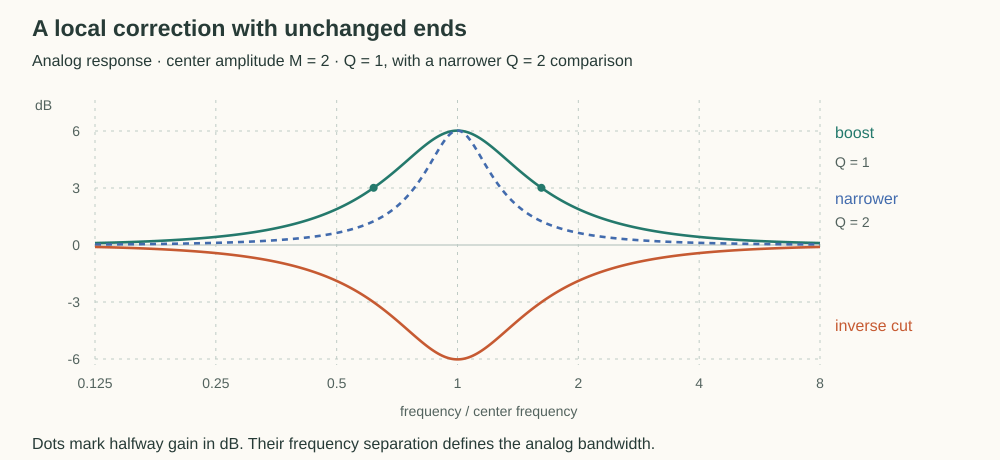

# Designing a Peaking EQ

A peaking EQ raises or lowers a band of frequencies while leaving low and high frequencies unchanged. Its controls name the response we want: a center frequency, a gain, and a width. How do those requirements become the coefficients of a filter?

## Define the Desired Response

Let $M\gt 0$ be the amplitude ratio at the center frequency $\Omega_0$, measured in radians per second. A boost has $M\gt 1$, a cut has $M\lt 1$, and $M=1$ leaves the signal unchanged. For example, $M=2$ doubles the center amplitude, which is approximately $+6$ dB.

Away from the center, the response should return to amplitude one. We also want a width control that concentrates or spreads the correction, and matching boosts and cuts that undo each other.

The horizontal axis is frequency relative to the center. The graph uses decibels so reciprocal boosts and cuts appear symmetrically about zero.

## Construct a Response with One Peak or Dip

A second-order system can hold a damped oscillation and shape the response around a frequency. Its general continuous transfer function is a ratio of quadratic polynomials:

$$
H_a(s)=\frac{c_2s^2+c_1s+c_0}{s^2+d_1s+d_0}.
$$

Here $s$ is a complex rate. To measure the response to a sustained tone at angular frequency $\Omega$, evaluate it at $s=j\Omega$. The [transfer-function companion](transfer-functions.md) develops that interpretation from wave motion and feedback.

We have chosen second order as a compact family with enough freedom for this shape.

### Preserve the Endpoints

At zero frequency, only the constant terms remain. At very high frequency, the leading powers dominate:

$$
H_a(0)=\frac{c_0}{d_0},
\qquad
\lim_{|s|\to\infty}H_a(s)=c_2.
$$

Unity at both ends therefore requires $c_0=d_0$ and $c_2=1$, leaving

$$
H_a(s)=\frac{s^2+c_1s+d_0}{s^2+d_1s+d_0}.
$$

The numerator and denominator now differ only in their linear terms. Those terms can change the response between the endpoints without changing the endpoints themselves.

### Set the Center and Gain

On the frequency axis,

$$
H_a(j\Omega)=\frac{d_0-\Omega^2+jc_1\Omega}{d_0-\Omega^2+jd_1\Omega}.
$$

Choose $d_0=\Omega_0^2$. At $\Omega=\Omega_0$, the shared real term vanishes and the response becomes

$$
H_a(j\Omega_0)=\frac{c_1}{d_1}.
$$

Thus the coefficient ratio sets the center gain. It remains to establish that the curve actually forms one peak or dip there and to find what controls its width.

Measure frequency relative to the center by setting $u=s/\Omega_0$. Define $c_z=c_1/\Omega_0$ and $c_p=d_1/\Omega_0$, which gives a dimensionless response

$$
P(u)=H_a(\Omega_0u)
=\frac{u^2+c_zu+1}{u^2+c_pu+1}.
$$

For this family, choose $c_z,c_p\gt 0$. Both quadratics then have roots in the left half-plane, so the filter and its reciprocal have decaying natural modes. The gain requirement is $c_z/c_p=M$.

### Verify the Shape

Write $\nu=\Omega/\Omega_0$, so a tone is evaluated at $u=j\nu$. Its squared amplitude response is

$$
|P(j\nu)|^2
=\frac{(1-\nu^2)^2+c_z^2\nu^2}
{(1-\nu^2)^2+c_p^2\nu^2}.
$$

For $\nu\gt 0$, divide both parts by $\nu^2$ and collect the frequency dependence into $v=(\nu-1/\nu)^2$:

$$
|P(j\nu)|^2=F(v)=\frac{v+c_z^2}{v+c_p^2},
\qquad
F'(v)=\frac{c_p^2-c_z^2}{(v+c_p^2)^2}.
$$

As frequency approaches the center, $v$ falls to zero, then rises again beyond the center. For a boost, $c_z\gt c_p$, so $F$ decreases with $v$. The response therefore rises toward the center and falls afterward. A cut reverses this behavior and makes one dip. Equal coefficients make the response flat.

Also, replacing $\nu$ with $1/\nu$ leaves $v$ unchanged. The analog response is therefore symmetric around the center on a logarithmic frequency axis, as in the figure.

## Give the Remaining Freedom a Bandwidth Meaning

The ratio $c_z/c_p$ already fixes the center amplitude $M$. We can now use the remaining freedom to set the width.

### Measure the Halfway Bandwidth

To measure width, choose the level halfway between unity and $M$ in decibels. Its amplitude ratio is the geometric mean $\sqrt M$, so the two crossing frequencies satisfy $|P|^2=M$.

For a non-flat response, substituting that level gives

$$
\frac{v+c_z^2}{v+c_p^2}=\frac{c_z}{c_p}
\quad\Longrightarrow\quad
v=c_zc_p.
$$

Let $b=\sqrt{c_zc_p}$. Since $v=(\nu-1/\nu)^2$, the positive crossings are

$$
\nu_{\mathrm{low}}=\frac{\sqrt{b^2+4}-b}{2},
\qquad
\nu_{\mathrm{high}}=\frac{\sqrt{b^2+4}+b}{2}.
$$

Their difference is simply $b$. Define the width control $Q$ as the reciprocal of that normalized bandwidth:

$$
Q=\frac{1}{\nu_{\mathrm{high}}-\nu_{\mathrm{low}}}
=\frac{1}{\sqrt{c_zc_p}}.
$$

Larger $Q$ gives a narrower correction. The ratio of the two coefficients controls gain, while their product controls width. At $M=1$, the response is flat and there are no distinct halfway crossings, though the coefficient formulas below remain valid.

### Express the Response Through Gain and Q

Solving $c_z/c_p=M$ and $c_zc_p=1/Q^2$ gives $c_z=\sqrt M/Q$ and $c_p=1/(Q\sqrt M)$. With the abbreviation $A=\sqrt M$, the response becomes

$$
P(u)=\frac{u^2+(A/Q)u+1}{u^2+u/(AQ)+1}.
$$

Replacing $M$ with $1/M$ swaps numerator and denominator. A matching boost and cut are therefore exact inverses for fixed parameters, while keeping the same analog halfway bandwidth. This is the peaking-EQ $Q$ convention used by the [Audio EQ Cookbook](https://www.w3.org/TR/audio-eq-cookbook/).

Next, [convert this response to a digital filter](bilinear-transform.md). The conversion preserves center gain but warps frequency, so the bandwidth interpretation changes.
