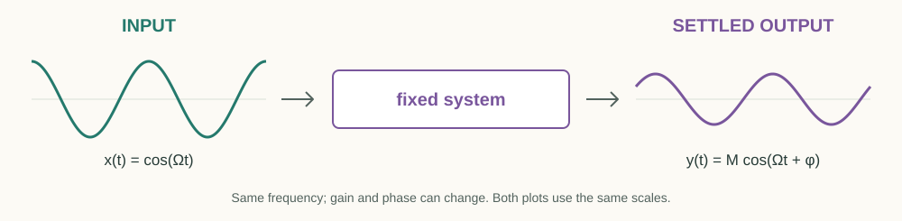
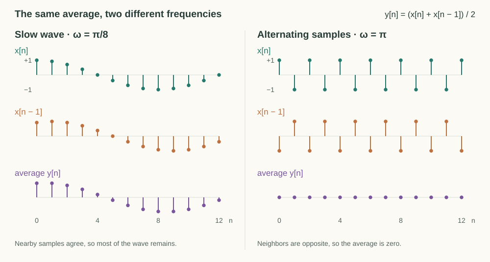
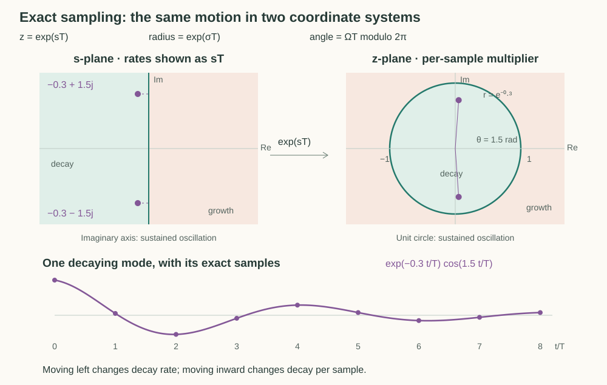

# Waves, Feedback, and Transfer Functions

Imagine an unknown but fixed audio circuit. Testing individual inputs gives us a catalog of experiments. We want a model of the system itself that predicts how it transforms an input.

We will build that model from waves, delays, and feedback, then use it to [design a peaking EQ](peaking-eq.md) from the response we want.



## Model the System Through Its Response to Waves

Assume a **linear, time-invariant system** (LTI). Linearity means that scaling and adding inputs scales and adds their outputs. Time invariance means that delaying an input only delays its output. We also assume any motion from the initial state decays, so we can study a settled response with the controls held fixed.

Under these assumptions, a steady tone keeps its frequency. The system changes only its amplitude and phase:

$$
x(t)=\cos(\Omega t)
\quad\longrightarrow\quad
y(t)=M\cos(\Omega t+\phi).
$$

The amplitude ratio $M$ and phase shift $\phi$ describe the system at angular frequency $\Omega$. Varying $\Omega$ traces its **frequency response**. This answers our modeling question because a complicated signal can be decomposed into waves, and linearity lets us combine their responses. Startup transients are separate from this steady response.

### Represent Gain and Phase with One Multiplier

Represent the tone by $e^{j\Omega t}$. The gain and phase shift become one complex multiplier, $H_a(j\Omega)=Me^{j\phi}$:

$$
H_a(j\Omega)e^{j\Omega t}=Me^{j(\Omega t+\phi)}.
$$

Taking the real part recovers the output cosine. This is the response we want to calculate from the system's equations.

To connect this description to an audio program, sample the wave every $T=1/F_s$ seconds, where $F_s$ is the sample rate. At sample $n$,

$$
x[n]=x(nT)=e^{j\Omega nT}=e^{j\omega n},
\qquad \omega=\Omega T.
$$

The physical wave is the same, but $\omega$ measures its phase advance in radians per sample. At 48 kHz, a 12 kHz tone has $\omega=\pi/2$, so each sample advances its phase by a quarter turn.

## A Computation That Distinguishes Frequencies

We want a computation that treats frequencies differently. Multiplying each sample by a constant cannot do that, but neighboring samples give us a clue. They are nearly equal in a slowly varying wave and can have opposite signs in a rapidly varying one. Averaging them should therefore preserve slow variation while suppressing some faster variation. Let us test that idea:

$$
y[n]=\frac{x[n]+x[n-1]}{2}.
$$

A constant signal passes unchanged, while a signal alternating between $+1$ and $-1$ disappears. To find what happens between these extremes, substitute $x[n]=e^{j\omega n}$:

$$
y[n]=\frac{e^{j\omega n}+e^{j\omega(n-1)}}{2}
=\frac{1+e^{-j\omega}}{2}\cdot x[n].
$$

The output-to-input multiplier is therefore $H_d(e^{j\omega})=(1+e^{-j\omega})/2$. A delay rotates the wave by $-\omega$, and adding the copies produces frequency-dependent reinforcement or cancellation. In particular, $H_d(1)=1$ at $\omega=0$ and $H_d(-1)=0$ at $\omega=\pi$.



### Generalize the Weights and Add Feedback

The equal weights made an average. Letting them vary gives a family of responses:

$$
y[n]=b_0x[n]+b_1x[n-1]
\quad\Longrightarrow\quad
H_d(e^{j\omega})=b_0+b_1e^{-j\omega}.
$$

So far, the output stops once the input and its delayed copy are gone. What if we also reuse a previous output? Then earlier outputs can keep producing later ones:

$$
y[n]=b_0x[n]+b_1x[n-1]-a_1y[n-1].
$$

This is **feedback**. With zero input, the recurrence becomes $y[n]=-a_1y[n-1]$, whose motion decays when $|a_1|\lt 1$. To include such motion alongside sustained waves, use the general exponential $z^n$. Each delay contributes $z^{-1}$, so substituting $x[n]=z^n$ and a particular output $y[n]=H_d(z)z^n$ gives

$$
H_d=b_0+b_1z^{-1}-a_1H_dz^{-1}
\quad\Longrightarrow\quad
H_d(z)=\frac{b_0+b_1z^{-1}}{1+a_1z^{-1}}.
$$

This is the **transfer function**. Feedback puts the unknown output on both sides of the recurrence, which produces the denominator. For a sustained tone, evaluate at $z=e^{j\omega}$ to recover the frequency response. The unit circle is simply the set of per-sample multipliers for those tones.

### A Second Output Delay Allows Oscillation

One real feedback coefficient gives geometric decay, possibly with alternating signs. Adding a second output delay lets us choose an oscillation frequency as well. With the input set to zero,

$$
y[n]=-a_1y[n-1]-a_2y[n-2]
\quad\xrightarrow{y[n]=z^n}\quad
z^2+a_1z+a_2=0.
$$

A conjugate pair of roots $re^{\pm j\theta}$ gives real motion

$$
y[n]=Cr^n\cos(n\theta+\phi).
$$

For $0\lt r\lt 1$, the radius sets decay and the angle sets oscillation. This is the fading transient we excluded when measuring the steady response.

Extending the input side to two delays as well gives

```math
\begin{aligned}
y[n]={}&b_0x[n]+b_1x[n-1]+b_2x[n-2]\\
&-a_1y[n-1]-a_2y[n-2].
\end{aligned}
```

The same exponential substitution yields

$$
H_d(z)=\frac{b_0+b_1z^{-1}+b_2z^{-2}}
{1+a_1z^{-1}+a_2z^{-2}}.
$$

This ratio of quadratics is a **biquad**. Its denominator contains the same roots that determine the natural motion. Uncanceled denominator roots are called **poles**, while uncanceled numerator roots are **zeros**. A pole pair near the unit circle can produce a strong response to nearby tones, while a zero on the circle cancels that tone if the denominator is nonzero.

## The Continuous Counterpart of the Sample Recurrence

The zero-input recurrence describes a decaying oscillation through a multiplier applied at each sample. A damped differential equation describes the same kind of motion through a rate of change. Comparing them connects the filter's poles to familiar decay rates and oscillation frequencies.

For the continuous oscillator $y''+d_1y'+d_0y=0$, the trial solution $y=e^{st}$ gives $s^2+d_1s+d_0=0$. A conjugate pair of roots $s=-\gamma\pm j\Omega_d$ produces real motion proportional to $e^{-\gamma t}\cos(\Omega_dt+\phi)$. Compare this with $r^n\cos(n\theta+\phi)$ from the sample recurrence. The roots describe decay and oscillation in both cases, using rates in continuous time and per-step multipliers in discrete time.

The response calculation carries over too. Differentiation multiplies $e^{st}$ by $s$, just as a delay multiplies $z^n$ by $z^{-1}$. With a weighted input and its derivatives driving the oscillator, substituting $x=e^{st}$ and $y=H_a(s)e^{st}$ gives

$$
y''+d_1y'+d_0y=c_2x''+c_1x'+c_0x
\quad\Longrightarrow\quad
H_a(s)=\frac{c_2s^2+c_1s+c_0}{s^2+d_1s+d_0}.
$$

As in the recurrence, the denominator determines the natural motion and the numerator determines how the input drives it. On the imaginary axis $s=j\Omega$, the exponential is a sustained tone, so $H_a(j\Omega)$ gives its gain and phase. This axis plays the role of the unit circle in the discrete response.

### The s-Plane and z-Plane

Sampling $e^{st}$ at $t=nT$ gives $(e^{sT})^n$, so the rate $s=\sigma+j\Omega$ corresponds to the per-sample multiplier

$$
z=e^{sT}=e^{\sigma T}e^{j\Omega T}.
$$

The imaginary axis maps to the unit circle, the left half-plane to its interior, and the right half-plane to its exterior. Decay becomes radius and frequency becomes angle, modulo $2\pi$.



The [peaking-EQ design](peaking-eq.md) uses the continuous response to arrange gain and width. Converting the driven filter into a sample computation requires more than sampling its natural modes, which is the task of the [bilinear transform](bilinear-transform.md).
