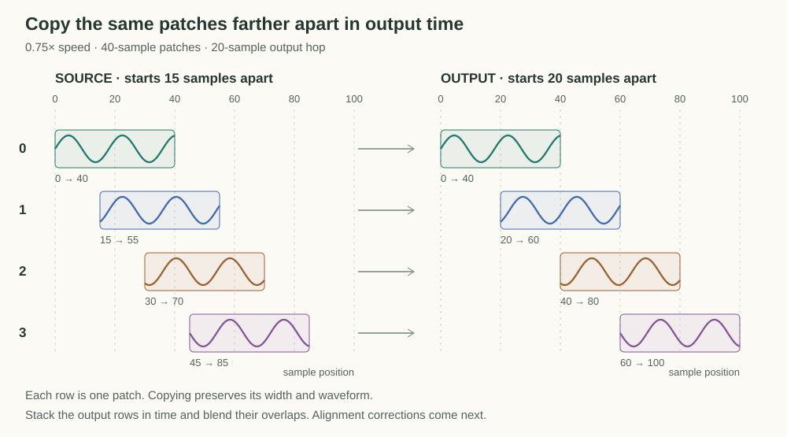
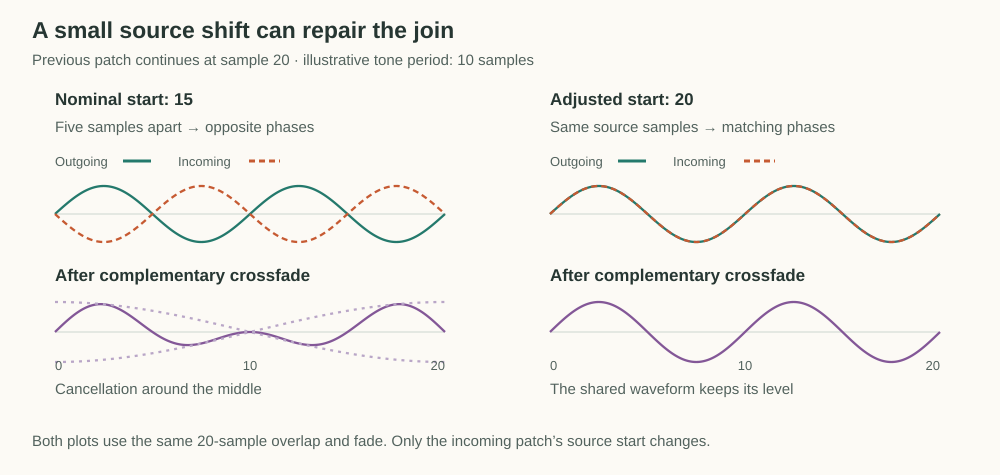
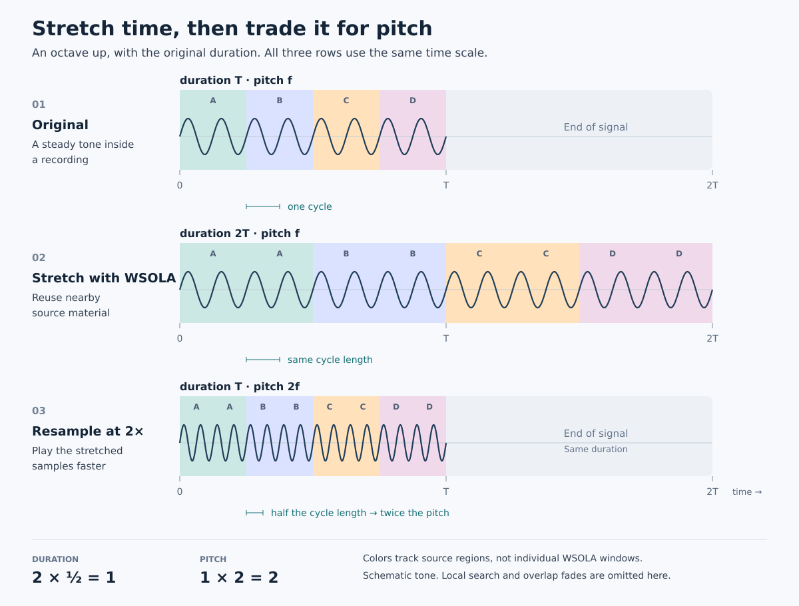
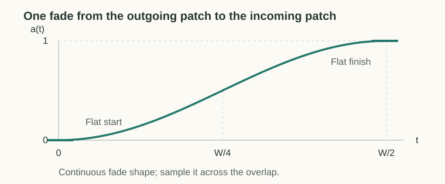

# WSOLA Time Stretching

To stretch a recording, take short patches from positions along the source timeline and stitch them into the output. For slower playback, advance less through the source between patches, so neighboring patches reuse some audio. For faster playback, advance farther. Each patch keeps its original sample spacing, which preserves the local oscillations that give the sound its pitch.

These nominal positions give us the desired timing, but the waveforms may line up poorly where patches overlap. WSOLA allows each patch to move slightly around its nominal position, searching for a better waveform match before blending the overlap. This document develops that picture and the equations used in [our implementation](../../src/lib/dsp/wsola.ts).

## Place Patches Along the Nominal Timeline

Take patches of length $W$ and place one every $H$ output samples. This spacing is called the **hop**. We use $H=W/2$, so neighboring patches overlap by half their length. These patches are also called source windows.

Our renderer uses 20 ms patches with a 10 ms output hop, and searches within a 30 ms region around each nominal position. At 48 kHz, these correspond to $W=960$, $H=480$, and a search width of $S=1440$ samples.

To make the positions easy to follow, use smaller illustrative counts of 40-sample patches and a 20-sample output hop. At $0.75\times$ speed, advance only 15 samples through the source for each new patch:

| Patch | Output start | Nominal source start |
| ----- | ------------ | -------------------- |
| 0     | 0            | 0                    |
| 1     | 20           | 15                   |
| 2     | 40           | 30                   |
| 3     | 60           | 45                   |

The output progresses 60 samples while the patch starts progress only 45 samples through the recording. Reusing source audio this way makes the output longer without slowing down the samples inside a patch.

More generally, patch $k$ starts at output position $kH$. For playback rate $r$, its **nominal source position** is

$$
p_k=rkH.
$$

This is the timing plan. A source of duration $T$ becomes approximately $T/r$ long. We still need to make the joins sound continuous.

## Repair the Alignment at Each Join

Consider the first two patches in the example. The first patch's second half starts at source sample 20, but the second patch's first half starts at sample 15. Those two pieces occupy the same output positions, so we will blend source samples that are five samples apart.

That offset may be harmless, or it may put peaks against troughs. For a tone with a ten-sample period, five samples is half a cycle. At equal blend weights, the two opposite phases cancel. Fading between patches avoids an abrupt switch, but it cannot by itself fix this alignment.

We therefore allow the new patch to slide a little around its nominal source position. The timing plan stays the same, while the adjustment gives us a chance to align the waveform before blending it.

### Choose the Waveform to Match

Consider the window we used on the previous hop. Its second half will overlap the next window's first half. If the next source window begins $H$ samples after the previous one's start, those halves contain exactly the same source samples.

Call this position the **natural continuation**, $n_k$. It gives us both a perfect overlap and a reference waveform for evaluating other starts.

Following that continuation forever would simply reproduce the source at its original rate. Each output hop would advance by $H$ samples in both source and output, regardless of $r$. To change duration, we must sometimes leave this exact continuation and find a similar waveform elsewhere.

### Keep the Search Near the Intended Time

Allow candidate starts $q$ within a region of width $S$ centered on the nominal position:

$$
q\in\left[p_k-\frac{S}{2},\quad p_k+\frac{S}{2}\right).
$$

This expresses the compromise. The nominal position controls progress through the recording, while the search region allows local adjustments for waveform alignment. A larger region offers more possible matches but also permits material from farther away in source time.

If the natural continuation lies in this region, we can select it immediately. Otherwise, we need a measure of how closely each candidate resembles it.

### Score the Candidate Matches

A good candidate puts peaks near peaks and troughs near troughs in the reference waveform. Treat each window as a vector: let $\mathbf{x}(q)$ be the vector of $W$ source samples beginning at $q$. We compare it with the natural continuation using **cosine similarity**:

$$
\rho(n_k,q)=
\frac{\langle\mathbf{x}(n_k),\mathbf{x}(q)\rangle}
{\|\mathbf{x}(n_k)\|\cdot \|\mathbf{x}(q)\|}.
$$

This is the cosine of the angle between the two window vectors. Matching waveform shapes with the same polarity point in the same direction and score 1, even if their amplitudes differ. Opposite-polarity shapes point in opposite directions and score -1. The comparison uses full windows, so both the immediate overlap and the following half-window contribute to the choice.

We can now express the selection rule. Let $s_k$ be the source start we select for hop $k$:

$$
s_k=\underset{q\in[p_k-S/2,\quad p_k+S/2)}{\arg\max}\quad \rho(n_k,q).
$$

The natural continuation scores 1 for a nonzero window, which justifies taking it directly whenever it lies inside the search region.

Once we have selected the window, its second half determines the next natural continuation:

$$
n_{k+1}=s_k+H.
$$

The two positions now have distinct roles. The natural continuation follows the window actually chosen, while the nominal position always comes from output time through $p_k=rkH$. A local alignment adjustment therefore does not shift the nominal timeline of every later window.

During slower playback, natural continuation advances faster than the nominal timeline. Eventually, it leaves the search region, so we select a matching patch earlier in the source. This reuses audio and extends the recording. During faster playback, the nominal timeline advances faster, so matching patches generally jump forward through the source.

## Blend the Aligned Patches

When the search selects a different source position, the overlapping waveforms may still differ. Crossfading introduces that difference gradually by fading out the previous patch while fading in the new one.

Let $f[j]$ and $g[j]$ be the outgoing and incoming samples at position $j$ in the overlap. Crossfading interpolates between them:

$$
y[j]=f[j]+a[j]\bigl(g[j]-f[j]\bigr).
$$

As the incoming weight $a$ moves from zero to one, the output moves from the previous patch to the new one. Matching samples pass through unchanged because their difference is zero. Opposite phases can still cancel, so blending complements the alignment search rather than replacing it.

Our implementation uses a Hann-shaped fade. The [Why Hann? appendix](#appendix-why-hann) shows the fade shape and explains why its flat endpoints help.

Sustained periodic sounds often provide good matches because similar waveforms recur. Attacks and mixtures of unrelated periods may not, so even the best available alignment can alter the sound.

## Trade Duration for Pitch with Resampling

Resampling changes duration and pitch together. Playing samples twice as fast halves the duration and raises pitch by an octave. WSOLA gives us a separate duration control, so we can first create extra time and then trade it for higher pitch.

For example, stretch a recording to twice its duration with WSOLA, keeping its local wave spacing. Then resample that stretched signal at twice the playback rate. Its duration returns to the original length, while its waves become twice as closely spaced. We have raised pitch by an octave without changing the recording's overall duration.

The colors track reused source regions schematically. They do not represent individual WSOLA windows or their overlap fades.

More generally, for a desired pitch multiplier $p$, use WSOLA at playback rate $1/p$ to multiply duration by $p$, then resample at rate $p$. The two duration changes cancel, while only resampling changes pitch:

$$
\text{duration factor}=p\cdot\frac{1}{p}=1,
\qquad
\text{pitch factor}=1\cdot p=p.
$$

### How Playback Uses This Relationship

Our player uses this fixed-duration pitch shifter to compensate for the pitch change introduced by playback speed. The buffer source controls speed, and the pitch-shifter worklet restores pitch without changing the resulting duration.

At half-speed playback, for example, the buffer source produces audio twice as long and an octave lower. The pitch shifter raises it by an octave without changing that longer duration. In this use case, the diagram's original signal is the already slowed input to the pitch shifter, and its final signal is the pitch-corrected slow playback.

More generally, the [buffer source](../../src/lib/recorder/audio-buffer-playback.ts) plays at rate $r$, which changes duration by $1/r$ and pitch by $r$. The [pitch-shift bus](../../src/lib/recorder/audio-track-playback.ts) requests the inverse pitch multiplier $p=1/r$. Internally, [`StreamingPitchShifter`](../../src/lib/dsp/pitch-shifter.ts) performs the WSOLA-and-resampling combination above, preserving the already changed duration while restoring pitch because $r\cdot(1/r)=1$.

## How Much Audio Must Be Available?

A candidate can start about half a search region ahead of the nominal position, and comparing it requires a full window beyond that start. At sample rate $F_s$, the source lookahead is roughly

$$
\text{lookahead scale}\approx\frac{W+S/2}{F_s}.
$$

With a 20 ms window and a 30 ms search region, this gives $20+30/2=35$ ms.

The natural-continuation window must also be available as the comparison reference. During slow playback it can reach slightly farther ahead, so the implementation reserves extra audio. This is source lookahead, while the complete pitch shifter's latency also depends on resampling and block buffering.

## Connect the Formulation to the Code

[`WsolaProcessor` and `StreamingWsola`](../../src/lib/dsp/wsola.ts) use the same selection and blending calculations. The first reads a complete source, while the second waits until incoming audio supplies the reference and candidate windows needed for a hop.

The equations describe the central window-selection problem. The code rounds positions to sample indices and approximates the maximum with a coarse search followed by local refinement. For silent windows, where cosine normalization is undefined, it assigns a similarity score of zero. For multiple channels, it combines all channels into one comparison and selects a shared source start, preserving their relative timing.

The overlap equations describe joins between successive windows. At startup, the implementation has no preceding window and fades in from silence. Source boundaries, output block sizes, and streaming buffer management are handled separately in the code.

| Mathematical role                         | Implementation                                             |
| ----------------------------------------- | ---------------------------------------------------------- |
| Nominal timeline and natural continuation | `WsolaProcessor.generateHop`, `StreamingWsola.generateHop` |
| Approximate similarity maximum            | `findBestCandidate`, `calculateSimilarity`                 |
| Complementary Hann blend                  | `createPeriodicHannWindow`, `overlapAddPlanar`             |

The [command-line renderer](../../tools/wsola.ts) supports listening experiments with playback rate, window length, and search width. The [visual companion](https://gisthost.github.io/?109135460ad3d821bc7f7ce66278e0bb/wsola-explainer.html) illustrates how source-window selection and overlap change the output.

## Appendix: Why Hann?

The incoming weight is the rising half of a Hann window:

$$
a(t)=\frac12\left(1-\cos\frac{2\pi t}{W}\right),
\qquad 0\le t\le W/2.
$$

The flat endpoints have a useful consequence. Treat the patches as differentiable waveforms for a moment. Differentiating $y=f+a(g-f)$ gives

$$
y'=f'+a(g'-f')+a'(g-f).
$$

The last term comes from changing the weight while the patches differ. With a linear fade, it switches on and off abruptly at the overlap boundaries. Here $a'$ is zero at both ends, so the blend meets the outgoing waveform's slope at the start and the incoming waveform's slope at the finish, without an added slope jump.

Avoiding these sharp boundaries helps limit high-frequency artifacts. Hann is one useful choice with this property, though it cannot repair a poor waveform match. For the related spectral view, see [Smith's discussion of window sidelobes](https://www.dsprelated.com/freebooks/SASP/Spectrum_Analysis_Windows.html).
