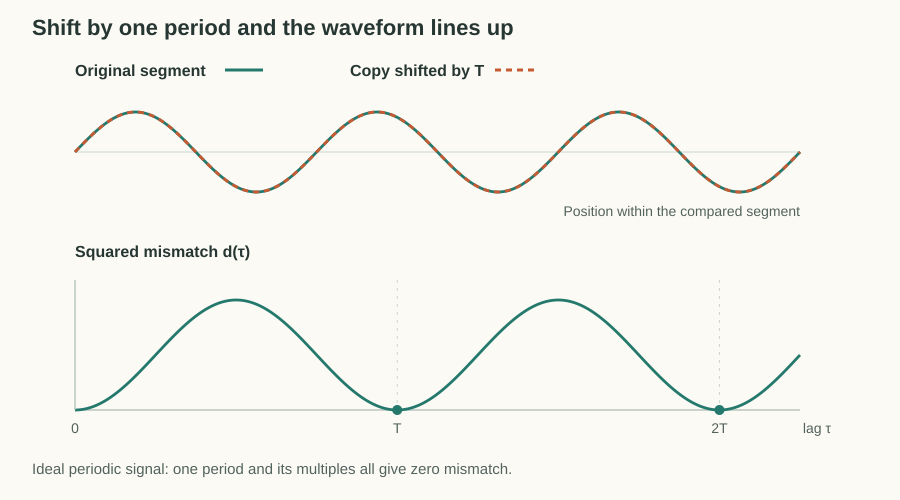
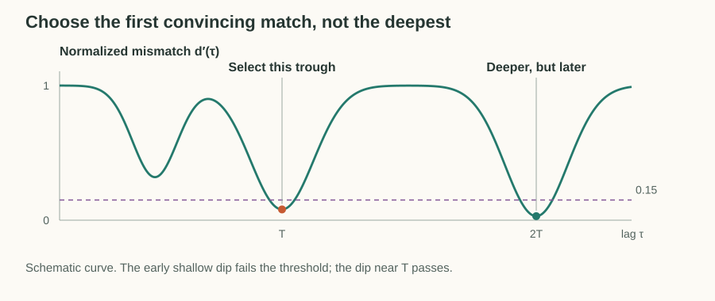
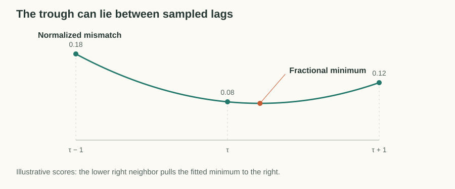

# YIN Pitch Detection

A sustained note produces a waveform that approximately repeats. The tuner uses YIN to find how far we can shift a short recording before the waveform lines up with itself. That shift reveals the period, which gives the frequency.

The useful match is not always the deepest one. A waveform also lines up after two or three periods, and neighboring samples can look similar even when we have barely shifted it. We will develop how YIN distinguishes a convincing period from these other matches, then refine it between sample positions.

## Find Repetition by Shifting the Waveform

A **lag** $\tau$ is a shift measured in samples. If the waveform repeats after $\tau$ samples at sample rate $`F_s`$, its frequency is

$$
f=\frac{F_s}{\tau}.
$$

At 48 kHz, a 110 Hz note repeats about every 436 samples. A longer period means a lower pitch, so doubling the estimated period would put the tuner one octave too low.

Our tuner reads 4096 samples per update, about 85 ms at 48 kHz. That contains roughly nine cycles of a 110 Hz note, but only about three and a half cycles of a 41.2 Hz bass E. We need enough audio to see repetition, while a longer window also retains more of the previous sound after a note changes.

To test a lag, compare a segment with a copy starting $\tau$ samples later. Treat those equal-length segments as vectors $`\mathbf{x}_0`$ and $`\mathbf{x}_\tau`$. Their squared distance is the **difference function**:

$$
d(\tau)=\|\mathbf{x}_0-\mathbf{x}_\tau\|^2.
$$

A good alignment makes this distance small. Repeating the comparison at successive lags produces a curve with troughs at plausible periods.

The figure uses a sine wave with exaggerated decay. At half a period, peaks meet troughs. At one period, the peaks align, but the later samples are quieter, so the mismatch remains above zero. The curve below is computed from the same signal. Each lag uses the same comparison length, keeping the amount of evidence consistent across the curve.

## Make Trough Depth Comparable

Raw distance has two problems. Louder signals produce larger squared differences, and a tiny shift can produce a small difference simply because nearby samples resemble each other. We want a low score to mean unusually good repetition, rather than just low volume or a small shift.

YIN divides the mismatch at each lag by the average mismatch over the lags leading up to it:

$$
d'(\tau)=\frac{d(\tau)}{\frac{1}{\tau}\sum_{k=1}^{\tau}d(k)}.
$$

This is the **cumulative mean normalized difference**. The prime labels the normalized score, not a derivative. Scaling the waveform multiplies both numerator and denominator by the same squared amplitude, so the ratio is unchanged.

A value near 1 means the current shift matches about as poorly as the average shift so far. A value near 0 means it matches much better. For example, a mismatch of 6 against an average of 100 gives $d'(\tau)=0.06$.

At lag 1, the numerator and denominator are identical, giving 1 whenever the mismatch is nonzero. Thus merely staying close to the unshifted waveform does not start the curve at a misleading zero. For uncorrelated noise, mismatches at different nonzero lags tend to be similar, so the normalized curve stays near 1 instead of forming convincing troughs.

## Choose the First Convincing Trough

Even after normalization, selecting the deepest trough can give the wrong period. If the waveform repeats after $T$ samples, it also repeats after $2T$ and $3T$. A later match can be deeper because of noise or changes between cycles, but selecting $2T$ would report half the frequency.

YIN instead scans from shorter to longer candidate lags and takes the first trough below a threshold. Our tuner uses

$$
d'(\tau)\lt\theta,
\qquad \theta=0.15.
$$

Crossing the threshold identifies a promising dip. The scan then follows it downhill to its local minimum. For values $0.20,0.12,0.06,0.08$, it crosses at $0.12$ and selects $0.06$. It stops there even if a later trough is deeper.

This favors the shortest period supported by convincing evidence. The threshold is a practical choice, and complex waveforms can still produce misleading matches.

The returned confidence expresses the same evidence as $c=1-d'(\tau)$. The threshold of 0.15 corresponds to confidence 0.85. This score describes periodicity evidence, not a calibrated probability that the note is correct. If no trough qualifies, the tuner retains the best mismatch to report confidence and rejects the estimate when that confidence is below 0.85.

## Refine the Period Between Samples

So far we have tested only whole-sample shifts. At 48 kHz, lags of 436 and 437 correspond to about 110.09 Hz and 109.84 Hz. The underlying minimum can fall between them, and estimating that position gives a smoother tuning reading.

Use the selected trough and its two neighbors to fit a small parabola. Its vertex estimates the fractional lag:

Write the three scores as $`y_-=d'(\tau-1)`$, $`y_0=d'(\tau)`$, and $`y_+=d'(\tau+1)`$. The vertex is at

$$
\hat\tau=\tau+\frac{y_--y_+}{2(y_--2y_0+y_+)}.
$$

Equal neighbors give zero adjustment. A lower right neighbor moves the minimum to the right, toward a longer period. The [appendix](#appendix-parabolic-interpolation-derivation) derives this expression from the three points.

Finally, convert the refined period back to frequency:

$$
\hat f=\frac{F_s}{\hat\tau}.
$$

The parabola is a local approximation. It refines the position of the chosen trough, but cannot correct a choice of the wrong period.

## Connect the Explanation to the Tuner

[`TunerAnalyser`](../../src/lib/tuner-analyser.ts) reads the latest mono waveform at most once every 50 ms. At that interval, its 4096-sample windows overlap, but each estimate is independent. The detector assumes one dominant pitched source and has no pitch history or polyphonic separation.

Before comparing periods, it measures RMS amplitude after subtracting the window's mean. This excludes constant offset from the level measurement. Windows at or below $-50$ dBFS are reported as `silent`. Louder input still needs convincing periodicity before it can be reported as `pitched`.

The configured pitch range is 30–2000 Hz. At 48 kHz, that corresponds to candidate lags of approximately 24–1600 samples. The code caps the largest lag at half the input window and uses the remaining samples as a fixed comparison span. It computes shorter lags too because normalization needs the cumulative mismatch leading up to each candidate.

Zero cumulative mismatch gets a normalized score of 1. Fractional refinement falls back to the integer lag at an array boundary or when the parabola's curvature is zero. These guards keep the calculations defined without adding periodicity evidence.

| Result     | Meaning                                                       |
| ---------- | ------------------------------------------------------------- |
| `silent`   | Input level is at or below $-50$ dBFS                         |
| `unstable` | Input is louder, but periodicity confidence is below 0.85     |
| `pitched`  | Input passes both checks and has a refined frequency estimate |

Note naming and cents offset happen outside the detector, using 12-tone equal temperament with A4 = 440 Hz. The window size, range, and thresholds are prototype settings whose reliability depends on the notes and recording conditions.

## References

- A. de Cheveigne and H. Kawahara, [YIN, a fundamental frequency estimator for speech and music](https://doi.org/10.1121/1.1458024)
- [pYIN algorithm breakdown](../bass-pitch/pyin.md), which extends period selection with probabilistic thresholds and temporal decoding

## Appendix: Parabolic Interpolation Derivation

Let $u$ measure the offset from the selected integer lag $\tau$. The three neighboring scores then have coordinates $`(-1,y_-)`$, $`(0,y_0)`$, and $`(1,y_+)`$. Approximate the curve between them with

$$
q(u)=Au^2+Bu+C.
$$

Substituting the three points gives

$$
y_-=A-B+C,\qquad y_0=C,\qquad y_+=A+B+C.
$$

Adding and subtracting these equations determines the coefficients:

$$
C=y_0,\qquad
A=\frac{y_- -2y_0+y_+}{2},\qquad
B=\frac{y_+-y_-}{2}.
$$

At a strict local trough, $A>0$, so the parabola opens upward. Its minimum occurs where the slope is zero:

$$
\frac{dq}{du}=2Au+B=0
\quad\Longrightarrow\quad
u=-\frac{B}{2A}
=\frac{y_- -y_+}{2(y_- -2y_0+y_+)}.
$$

The refined lag is $\hat{\tau}=\tau+u$. When the two neighboring scores are equal, $`y_-=y_+`$, the offset is zero. When the right neighbor has a lower score than the left, the offset is positive, moving the estimated minimum toward the right.

The parabola provides a local approximation to the trough, allowing an estimate between the sampled lag positions.
