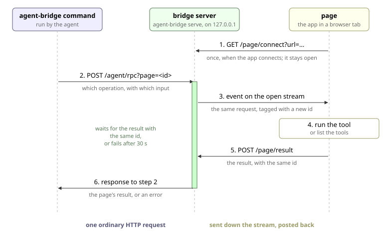

# Agent Bridge

`agent-bridge` lets a local agent with a shell, such as Claude Code, call tools that an open web app exposes and read the results. The app has no server of its own, so the page connects to a small local process, and the agent talks to that process from the command line.

Install the CLI globally from GitHub:

```sh
pnpm i -g "github:hi-ogawa/toy-midi#path:/packages/agent-bridge"
```

Other apps depend on the page client the same way, pinned to a commit with `github:hi-ogawa/toy-midi#<sha>&path:/packages/agent-bridge`. The package ships TypeScript source, so the app's bundler compiles it.

```sh
agent-bridge serve --origin https://toy-midi.hiro18181.workers.dev
agent-bridge get-tools
agent-bridge execute-tool toy_midi_eval --arg code='return runtime.store.get().tempo'
```

The page decides which tools it exposes when it connects. A tool has the [WebMCP](https://webmachinelearning.github.io/webmcp/) shape, so the same definitions can later be registered with `document.modelContext`:

```ts
import { connectAgentBridge } from "@hiogawa/agent-bridge/client";

const disconnect = connectAgentBridge({
  bridgeUrl: "http://localhost:4747",
  tools: [
    {
      name: "set_tempo",
      description: "Set the project tempo in BPM.",
      inputSchema: {
        type: "object",
        properties: { bpm: { type: "number" } },
        required: ["bpm"],
      },
      execute: ({ bpm }) => {
        runtime.setTempo(bpm);
        return { isError: false };
      },
    },
  ],
});
```

## How it works



A call takes two hops, because the page can only reach the bridge and never the other way around. The CLI's hop is one HTTP request and response. The page's hop is split in two: the bridge pushes the call down the page's event stream, and the page posts the result back, which the bridge pairs with the waiting `/rpc` request by `requestId`. The bridge forwards `{ method, args }` without knowing the methods, so only the CLI and the page know `PageRpc`.

Each open event stream is one connected page with its own id. `GET /pages` lists them and never reaches a page, because the bridge answers it from its own list. A call goes to the page chosen with `?page=<id>`, which the CLI sets from `--page`, or else to the most recently connected one.

### Security

The bridge listens on `127.0.0.1`, port 4747 by default. Pages and agents use separate endpoints, and the `Origin` header tells them apart: page requests must carry a listed origin, and agent requests must carry none. Anything else gets 403. Every request must also be addressed to `localhost` or `127.0.0.1` in its `Host` header, so a site that rebinds its DNS to the loopback address cannot reach the agent endpoints as same-origin.

## Tools

- `execute` receives the input object and resolves to `{ isError: false, value? }` on success or `{ isError: true, error }` on failure, as with `isError` in MCP tool results. WebMCP hides a thrown error's message from the agent, so a failure the agent can act on belongs in the result.
- The result must be JSON-serializable. A value that `JSON.stringify` rejects, such as a circular object, comes back as an error.
- The bridge itself reports a thrown error, or a call to an unknown tool, with its stack.
- The bridge waits 30 seconds for the page before failing with a timeout. The tool keeps running in the page after that.

## CLI

| Command                                   | Input                                                   | Output                                                                                           |
| ----------------------------------------- | ------------------------------------------------------- | ------------------------------------------------------------------------------------------------ |
| `agent-bridge serve`                      | `--origin <origin>`, repeatable, required               | Runs the bridge in the foreground and logs pages connecting and leaving                          |
| `agent-bridge get-tools`                  |                                                         | Each tool's name, description, and input schema as plain text                                    |
| `agent-bridge execute-tool <tool> [json]` | Input JSON, default `{}`, plus `--arg key=value` fields | The `value` of the result, a string as is, anything else as indented JSON, or nothing when empty |
| `agent-bridge pages`                      |                                                         | Connected pages as indented JSON on stdout                                                       |

Every command takes `--port <number>`, and `serve --port 0` listens on a free port and logs it. `get-tools` and `execute-tool` take `--page <id>` to choose the page. `--arg` is repeatable and sets a string field, and a value of `-` reads stdin, so code or long text can be piped in without JSON escaping. A failed request, an `isError` result, a timeout, no connected page, or no running bridge prints the error to stderr and exits with code 1, so the agent can tell success from failure by exit code alone.

## HTTP endpoints

### Agent endpoints

| Request             | Body               | Response                                                                             |
| ------------------- | ------------------ | ------------------------------------------------------------------------------------ |
| `POST /rpc?page=id` | `{ method, args }` | 200 `{ ok: true, value }`, 500 `{ ok: false, error }`, 503 when no page is connected |
| `GET /pages`        |                    | `[{ id, origin, url, connectedAt }]`                                                 |

`/rpc` forwards the call to the page as is, so the bridge has no endpoint per method. The CLI's `get-tools` and `execute-tool` call `getTools()` and `executeTool({ name }, input)` through it.

### Page endpoints

| Request                 | Body                                                                       | Response                                                                                                                                                                 |
| ----------------------- | -------------------------------------------------------------------------- | ------------------------------------------------------------------------------------------------------------------------------------------------------------------------ |
| `GET /connect?url=href` |                                                                            | Server-Sent Events: `request` `{ requestId, method, args }`, which calls `getTools()` or `executeTool({ name }, input)` on the page, named after WebMCP's `ModelContext` |
| `POST /result`          | JSON `{ requestId, ok: true, value }` or `{ requestId, ok: false, error }` | 204                                                                                                                                                                      |

The methods, endpoints, and events are in `src/protocol.ts`, and the generic RPC messages in `src/rpc.ts`. The bridge sends a comment every 15 seconds to keep the stream open. A page that reconnects gets a new id. `connectAgentBridge` implements the page side, posting results as `text/plain` so they need no CORS preflight.
