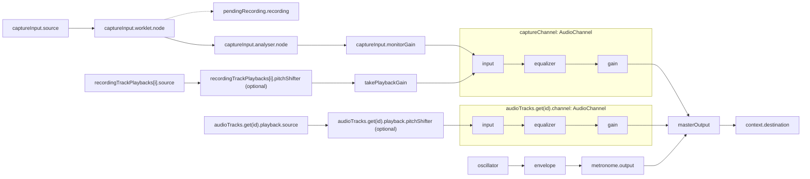

# Recorder signal chains

Labels match implementation fields. AudioChannel fields are scoped by their subgraph. `i` identifies a take-region playback, and `id` identifies an audio track. `oscillator` and `envelope` are locals in `scheduleOscillatorClick()`.

Solid arrows carry audio. The dotted arrow carries recorded PCM to `pendingRecording.recording`. When `pitchShifter` is absent, `source` connects directly to the next node.

