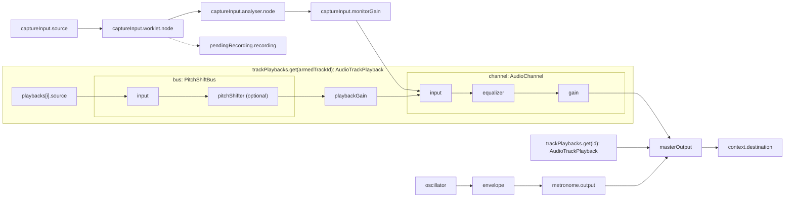

# Recorder signal flow

The diagram shows how audio flows from sources through processing to recording and output. Every audio track uses the same playback and channel structure. The shared capture input monitors through the armed track's channel, and the armed track stays fixed from the moment a recording starts until it finishes processing.

