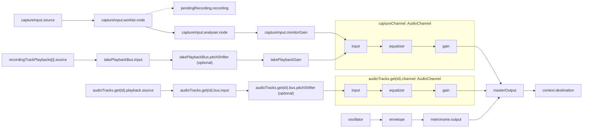

# Recorder signal flow

The diagram shows how audio flows from sources through processing to recording and output.

[AudioBufferPlayback](audio-buffer-playback.ts) schedules sources and applies the transport playback rate. [PlaybackBus](playback-bus.ts) sums those sources before correcting pitch, with one bus shared by all take regions and one per audio track. At normal speed, the bus connects its input directly to its output. At other speeds, the pitch shifter processes silence when sources provide no input, so gaps advance its stream clock and buffered audio can drain. Pitch-shifter state lasts for a transport run and resets on stop, seek, loop restart, or speed change. Live monitoring joins the Capture channel after the take bus, so it bypasses playback pitch correction.
