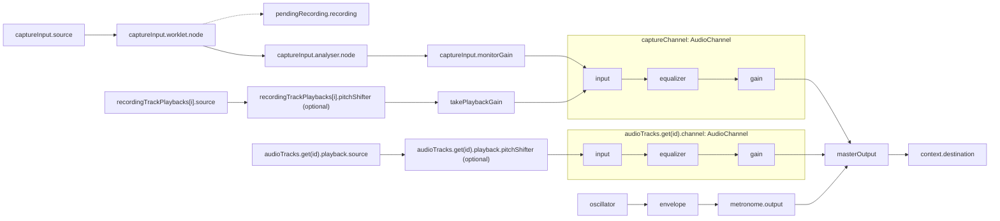

# Recorder audio routing

Update this document in the same PR when changing routing, control scope, or graph lifetime. The diagram describes the current implementation. Keep comments beside the code for decisions that are easy to miss, such as why take playback needs its own gain node.

## Signal flow

Labels use implementation field names, with AudioChannel fields scoped by their subgraph. `i` denotes a take-region playback, `id` denotes an audio track, and `pendingRecording` comes from runtime state. `oscillator` and `envelope` are locals in `scheduleOscillatorClick()`. Solid arrows carry audio. The dotted arrow carries recorded PCM from the capture worklet to the recording accumulator. When `pitchShifter` is absent, `source` connects directly to the next node.

[CaptureInput](capture-input.ts) connects the device, capture worklet, analyser, and monitor gain. [The worklet](capture-worklet.ts) selects one input channel and sends samples to [ActiveRecording](recording.ts) when recording is active. Its audio output continues independently of recording, so monitoring and metering also work while stopped.

[AudioBufferPlayback](audio-buffer-playback.ts) schedules each source. At playback rates other than 1, it adds pitch correction before the channel input. [AudioChannel](audio-channel.ts) constructs the complete stereo `input → equalizer → gain → output` graph. [RecorderRuntime](runtime.ts) connects the sources and channels to Master, and [RecorderMetronome](metronome.ts) supplies clicks through its own gain.

Reference video audio is separate. [YouTubePlayerPlayback](youtube-player-playback.ts) follows the transport through the player API, but its audio does not enter this Web Audio graph or pass through Master.

## Control scope

| Control                         | What it changes                                                                                                                            |
| ------------------------------- | ------------------------------------------------------------------------------------------------------------------------------------------ |
| Input device and channel        | The source used for recording, metering, and live monitoring.                                                                              |
| Monitor                         | `monitorGain` switches live input between silence and unity gain before Capture FX. It does not switch take playback or recording.         |
| Capture EQ and channel gain     | Process both live monitoring and take playback. Channel gain combines the fader, mute, and track solo rules.                               |
| Audio track EQ and channel gain | Process that track's playback using the same channel graph.                                                                                |
| Take mute and solo              | Determine the active takes used to derive playback regions and the exported arrangement.                                                   |
| `takePlaybackGain`              | Silences existing takes during recording and processing. It returns to unity when recording finishes. It does not control live monitoring. |
| Master gain                     | Scales Capture, audio tracks, and metronome output together.                                                                               |

Recording stores dry samples before monitoring, EQ, channel gain, and Master. Changing these controls does not change the recorded PCM. The input meter is also before these controls, so it can show activity while the audible output is muted. Input monitoring defaults to off when an input is opened.

[deriveTrackMix](mix.ts) owns track mute and solo rules. Runtime applies its result to channel gains while maintaining `takePlaybackGain` separately, so a mix edit during recording cannot make existing takes audible again.

## Ownership and lifetime

[RecorderRuntime](runtime.ts) creates the AudioContext, Master, transport, metronome, and take playback gain in its construction path. Callers await `init()` before using the audio engine. It registers the EQ and pitch-shifter worklets, then constructs the Capture channel. Repeated initialization preserves that channel. [The project-loading hook](../../components/recorder/use-recorder-project.ts) awaits initialization before deserializing project state.

Runtime stores each audio track's playback and channel together. Removing a track or replacing project state disposes both. Capture has one persistent channel shared by all take region playbacks and the monitored input. Rebuilding take regions replaces their playback objects while preserving the Capture EQ state and graph. Replacing the input disposes the old device stream and input graph while preserving the Capture channel.

[AudioContextTransport](transport.ts) owns playback timing and starts or stops its participants. Playback objects own their scheduled buffer sources and optional pitch-shifter nodes, which are recreated when playback restarts. Channels own their EQ and gain nodes, so transport stops and take boundaries do not recreate channel processing.

## Offline export

[mix.ts](mix.ts) snapshots committed audio tracks and take regions, then constructs one AudioChannel per track in a separate OfflineAudioContext. All regions of a track feed the same channel. The renderer registers its own EQ worklet before constructing those channels.

Export applies track EQ, derived channel gains, and Master gain at normal playback speed. It excludes live input, metronome, and reference video audio. It does not use the live take playback gain. Runtime rejects export during recording or processing. The offline graph ends at the committed arrangement's extent, so it does not append an effects tail beyond that endpoint.
