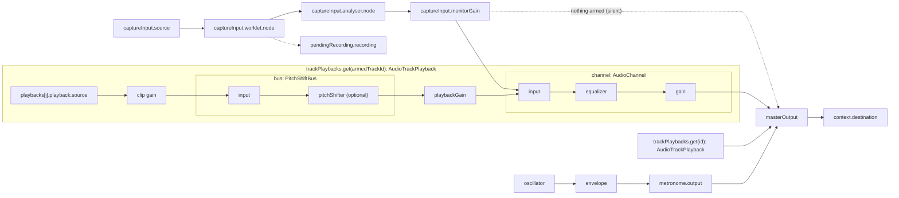

# Recorder signal flow

The diagram shows how audio flows from sources through processing to recording and output.

```mermaid
flowchart LR
    captureSource["captureInput.source"] --> captureWorklet["captureInput.worklet.node"]
    captureWorklet -.-> recording["pendingRecording.recording"]
    captureWorklet --> analyser["captureInput.analyser.node"]
    analyser --> monitorGain["captureInput.monitorGain"]
    monitorGain --> captureInput
    monitorGain -. "nothing armed (silent)" .-> masterOutput

    subgraph captureTrack["trackPlaybacks.get(armedTrackId): AudioTrackPlayback"]
        takeSource["playbacks[i].playback.source"] --> clipGain["clip gain"]
        clipGain --> takeBusInput
        subgraph takePitchShiftBus["bus: PitchShiftBus"]
            takeBusInput["input"] --> takePitchShifter["pitchShifter (optional)"]
        end
        takePitchShifter --> takePlaybackGain["playbackGain"]
        takePlaybackGain --> captureInput
        subgraph captureChannel["channel: AudioChannel"]
            captureInput["input"] --> captureEqualizer["equalizer"]
            captureEqualizer --> captureGain["gain"]
        end
    end

    captureGain --> masterOutput["masterOutput"]
    audioTrack["trackPlaybacks.get(id): AudioTrackPlayback"] --> masterOutput
    oscillator["oscillator"] --> envelope["envelope"]
    envelope --> metronomeOutput["metronome.output"]
    metronomeOutput --> masterOutput
    masterOutput --> destination["context.destination"]
```
